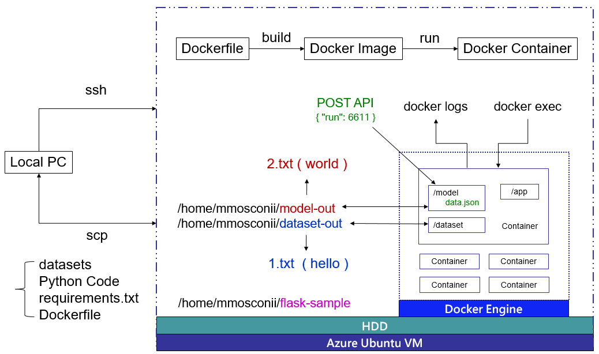

# How To Build and Deploy a Flask Application Using Docker on Ubuntu

## Contents
- [Flow](#flow)
- [Logging in to VM](#logging-in-to-vm)
- [Install Docker Engine](#install-docker-engine)
- [Upload flask-sample to VM](#upload-flask-sample-to-vm)
- [Build Docker Image](#build-docker-image)
- [List Docker Image](#list-docker-image)
- [Create Folders and Add files](#create-folder)
- [Add VM Port](#add-vm-port)
- [Run Docker Image](#run-docker-image)
- [Check Docker Container](#check-docker-container)
- [Check API from Browser](#check-api-from-browser)
- [Docker Container Log](#docker-container-log)
- [Into the Container](#into-the-container)
- [Use Postman to Check API](#use-postman-to-check-api)
- [Copy a file from Container to VM](#copy-a-file-from-container-to-vm)
- [Copy a file from VM to Container](#copy-a-file-from-vm-to-container)
- [Stop Container](#stop-container)
- [Remove Container](#remove-container)
- [Remove Docker Image](#remove-docker-image)
- [Contributor](#contributor)
- [License](#license)

## Flow


## Logging in to VM
* On Local
  ```
  ssh VM-ACCOUNT@VM-IP
  ```

## Install Docker Engine
* On Local
  ```
  Download https://github.com/ArcherHuang/Docker-Python-Flask Repository
  
  cd to Docker-Python-Flask Repository
  
  scp ./Script/install-docker.sh VM-ACCOUNT@VM-IP:/home/VM-ACCOUNT
  ```
* On VM
  ```
  cd ~
  
  chmod 777 install-docker.sh

  sudo ./install-docker.sh
  ```

## Upload flask-sample to VM
* On VM
  ```
  mkdir ~/flask-sample
  ```
* On Local
  ```
  scp flask-sample/* VM-ACCOUNT@VM-IP:/home/VM-ACCOUNT/flask-sample
  ```

## Build Docker Image
* On VM
  ```
  sudo docker build -t mmosconii/docker-python:0.1 .
  ```

## List Docker Image
* On VM
  ```
  sudo docker images
  ```

## Create Folder
* On VM
  ```
  cd ~

  mkdir dataset-out

  mkdir model-out

  echo "hello" > ~/dataset-out/1.txt

  echo "world" > ~/model-out/2.txt
  ```

## Add VM Port
* On Chrome
  * Login Azure Portal from Browser > Click `Networking` > Click `Add inbound security rule` > Click `Destination port ranges` > Input `80` > Click `Add`
  
  

## Run Docker Image
* On VM
  ```
  sudo docker run -d -p 80:80 --name=test-dev -v /home/VM-ACCOUNT/dataset-out:/dataset -v /home/VM-ACCOUNT/model-out:/model mmosconii/docker-python:0.1
  ```

## Check Docker Container
* On VM
  ```
  sudo docker ps -a
  ```

## Check API from Browser
* On Local
  * http://VM-IP
  

## Docker Container Log
* On VM
  ```
  sudo docker logs -f test-dev
  ```

## Into the Container
* On VM
  ```
  sudo docker exec -it test-dev bash
  ```

## Use Postman to Check API
* GET API
  
* POST API
  * Body
    ```
    {
      "run": 66
    }
    ```
  

## Copy a file from Container to VM
* On VM
```
echo "Lucky seven" > ~/filename.txt

sudo docker ps -a

sudo docker cp CONTAINER-ID:/app/filename.txt ~/777.txt
```

## Copy a file from VM to Container
```
sudo docker ps -a

sudo docker cp ~/filename.txt CONTAINER-ID:/app/filename.txt 
```

## Stop Container
* On VM
  ```
  sudo docker ps -a
  
  sudo docker stop CONTAINER-ID
  ```

## Remove Container
* On VM
  ```
  sudo docker ps -a
  
  sudo docker rm CONTAINER-ID
  ```

## Remove Docker Image
* On VM
  ```
  sudo docker image prune -a
  ```

## Contributor
* [Huang, Cheng-Chuan](https://github.com/ArcherHuang)

## License
This sample is licensed under the [MIT](./LICENSE) license.
